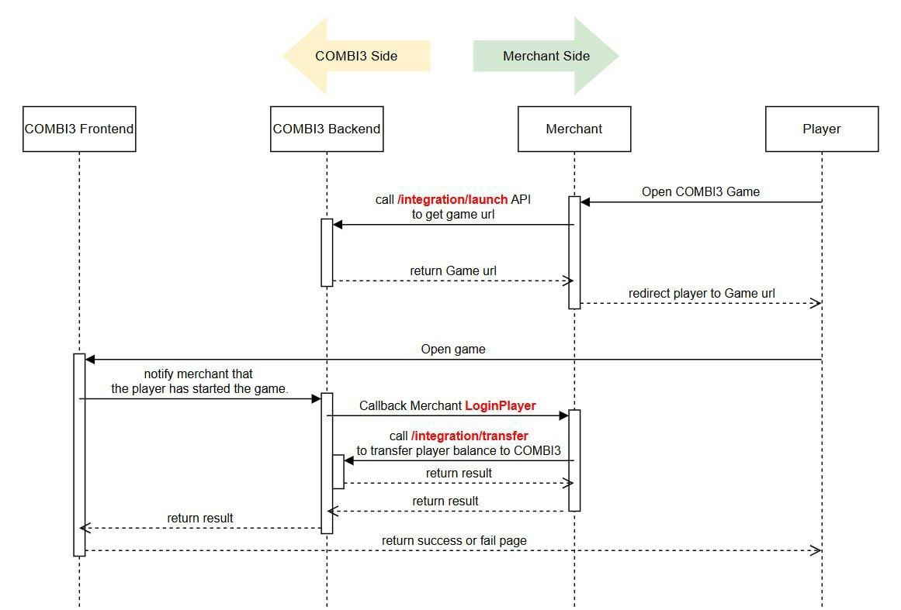

# Platform Integration API Documentation

**Version:** 1.2  
**Last Updated:** February 25, 2026  

**Change Highlights (Platform Spec + Runtime Sync on February 25, 2026):**
- Synced onboarding requirements from `Integration_API_Updated_0225.md` (merchant-provided inputs, provider-returned info).
- Added security/runtime constraints used by implementation: IP whitelist enforcement and callback launch-session gate.
- Clarified integration request/response details to match implemented APIs (including `transferId`/`orderNo` alias and launch URL payload).
- Added missing integration error codes used by implementation (`1005`, `2003`, `6001`-`6006`).

---

## Table of Contents

1. [Integration Application & Activation](#integration-application--activation)
2. [Overview](#overview)
3. [Authentication](#authentication)
4. [Signature Generation](#signature-generation)
5. [Base URL](#base-url)
6. [Common Response Format](#common-response-format)
7. [Error Codes](#error-codes)
8. [API Endpoints](#api-endpoints)
   - [Create Account](#1-create-account)
   - [Transfer](#2-transfer)
   - [Get Bet History](#3-get-bet-history)
   - [Get Transfer History](#4-get-transfer-history)
   - [Launch Game](#5-launch-game)
   - [All Transfer Out](#6-all-transfer-out)
   - [Callback: LoginPlayer (Merchant Side)](#7-callback-loginplayer-merchant-side)
   - [Callback: UpdateBalance (Merchant Side)](#8-callback-updatebalance-merchant-side)
   - [Get Bet Limit](#9-get-bet-limit)
   - [Set Bet Limit](#10-set-bet-limit)
   - [Get Token Values](#11-get-token-values)
   - [Set Token Values](#12-set-token-values)
   - [Launch Session Start (Platform Runtime)](#13-launch-session-start-platform-runtime)
9. [Data Types](#data-types)
10. [Code Examples](#code-examples)

---

## Integration Application & Activation

### Information Required from Merchant Before Account Creation

- `currency` code for this merchant.
- Default bet-limit settings:
  - Global: `maxBetLimit`, `minBetLimit`.
  - Per rule: `bigSmall`, `oddEven`, `eachDouble`, `eachTripple`, `sum`, `single`, `anyTripple` with `maxBetLimit` and `minBetLimit`.
- Callback URLs:
  - `LoginPlayer` callback URL.
  - `UpdateBalance` callback URL.
- Integration source IP whitelist (all IPs that will call integration APIs).

### Information Returned by Game Provider After Account Creation

- Merchant ID (`merchantId`).
- Merchant hash key (`hashKey`).
- Provider callback source IP whitelist for merchant callback endpoints.

---

## Overview

This document describes the Integration API for platform partners to integrate the Hi-Lo BTC game into their systems. The API allows partners to:

- Create player accounts
- Transfer funds into/out of player wallets
- Query bet history
- Query transfer history
- Launch the game with authenticated player sessions
- Transfer all remaining player balance back to merchant
- Support merchant callback verification during login and offline settlement
- Retrieve and configure global/per-rule bet limits and token values

All API endpoints use **HTTP POST** method and accept/return **JSON** payloads.

---

## Authentication

Every **merchant-signed integration request** requires authentication through:

1. **Merchant ID** (`merchantId`): Your unique merchant identifier provided during onboarding
2. **Timestamp** (`timestamp`): Current Unix timestamp in seconds (10 digits)
3. **Signature** (`hash`): SHA256 hash of request parameters combined with your secret key
4. **IP whitelist**: caller IP must exist in merchant `integrationAllowedIps`

`POST /integration/launch/session/start` is a runtime endpoint and uses Bearer launch JWT auth instead of merchant signature fields.

### Timestamp Validation

- Runtime validation uses `now - timestamp` and requires `0 <= diff <= toleranceSec`.
- Default tolerance is **10 seconds** (`INTEGRATION_TIMESTAMP_TOLERANCE_SEC`).
- Future timestamps are rejected.
- Timestamps outside this window are rejected with error code `1002`.

---

## Signature Generation

### Hash Key

Your hash key is a **32-character BASE64** string provided during merchant onboarding. Keep this secret and never expose it in client-side code.

### Signature Algorithm

```
hash = SHA256(param1 + "&" + param2 + "&" + ... + "&" + hashKey)
```

**Steps:**
1. Concatenate all parameters (in the specified order for each API) with `&` separator
2. Append `&` followed by your `hashKey`
3. Compute SHA256 hash of the resulting string
4. Convert to lowercase hexadecimal string (64 characters)

### Example (JavaScript/Node.js)

```javascript
const crypto = require('crypto');

function generateSignature(params, hashKey) {
  const data = params.join('&') + '&' + hashKey;
  return crypto.createHash('sha256').update(data).digest('hex');
}

// Example for AccountCreate
const merchantId = 'MERCHANT001';
const account = 'player123';
const timestamp = Math.floor(Date.now() / 1000);
const hashKey = 'your-32-char-secret-key-here!!!';

const hash = generateSignature([merchantId, account, timestamp.toString()], hashKey);
```

### Example (Python)

```python
import hashlib
import time

def generate_signature(params, hash_key):
    data = '&'.join(params) + '&' + hash_key
    return hashlib.sha256(data.encode()).hexdigest()

# Example for AccountCreate
merchant_id = 'MERCHANT001'
account = 'player123'
timestamp = int(time.time())
hash_key = 'your-32-char-secret-key-here!!!'

hash_value = generate_signature([merchant_id, account, str(timestamp)], hash_key)
```

### Example (Java)

```java
import java.security.MessageDigest;
import java.nio.charset.StandardCharsets;

public String generateSignature(String[] params, String hashKey) {
    String data = String.join("&", params) + "&" + hashKey;
    MessageDigest digest = MessageDigest.getInstance("SHA-256");
    byte[] hash = digest.digest(data.getBytes(StandardCharsets.UTF_8));
    StringBuilder hexString = new StringBuilder();
    for (byte b : hash) {
        String hex = Integer.toHexString(0xff & b);
        if (hex.length() == 1) hexString.append('0');
        hexString.append(hex);
    }
    return hexString.toString();
}
```

---

## Base URL

| Environment | Base URL |
|------------|----------|
| Production | `https://api.your-game-domain.com` |
| Sandbox | `https://sandbox-api.your-game-domain.com` |

All endpoints are prefixed with `/integration/`

---

## Common Response Format

All API responses follow this structure:

```json
{
  "success": true | false,
  "errorCode": 0,
  "errorMessage": "",
  "data": { ... } | null
}
```

| Field | Type | Description |
|-------|------|-------------|
| `success` | boolean | `true` if request succeeded, `false` otherwise |
| `errorCode` | integer | `0` on success, error code on failure |
| `errorMessage` | string | Empty on success, error description on failure |
| `data` | object/null | Response data on success, `null` on failure |

> Integration APIs return HTTP `200` for both success and business errors; use `success` / `errorCode` for result handling.

---

## Error Codes

| Code | Name | Description |
|------|------|-------------|
| `0` | SUCCESS | Request completed successfully |
| `1001` | INVALID_SIGNATURE | Signature verification failed |
| `1002` | TIMESTAMP_EXPIRED | Timestamp is outside valid window (default: <=10 seconds and not future) |
| `1003` | MERCHANT_NOT_FOUND | Merchant ID not found in system |
| `1004` | MERCHANT_INACTIVE | Merchant account is deactivated |
| `1005` | IP_NOT_ALLOWED | Client IP is not in merchant integration whitelist |
| `2001` | ACCOUNT_ALREADY_EXISTS | Player account already exists |
| `2002` | ACCOUNT_NOT_FOUND | Player account not found |
| `2003` | ACCOUNT_DISABLED | Player account is disabled |
| `3001` | INSUFFICIENT_BALANCE | Insufficient balance for withdrawal |
| `3002` | DUPLICATE_ORDER_NUMBER | Transfer ID already used |
| `3003` | INVALID_TRANSFER_TYPE | Invalid transfer type (must be 0 or 1) |
| `4001` | INVALID_PAGE_SIZE | Page size must be between 1 and 100 |
| `4002` | INVALID_PAGE_NUMBER | Page number must be >= 1 |
| `5001` | INVALID_BET_AMOUNT_LIMIT | Invalid bet amount limit |
| `5002` | INVALID_TOKEN_VALUES | Invalid token values |
| `6001` | CALLBACK_FIELDS_REQUIRED | Callback mode requires `playerId` and `accessToken` |
| `6002` | CALLBACK_MERCHANT_NOT_CONFIGURED | Merchant callback mode is not configured |
| `6003` | LAUNCH_SESSION_NOT_FOUND | Launch session not found |
| `6004` | LAUNCH_SESSION_NOT_ACTIVE | Launch session is not active |
| `6005` | LOGIN_PLAYER_CALLBACK_FAILED | LoginPlayer callback failed |
| `6006` | UPDATE_BALANCE_CALLBACK_FAILED | UpdateBalance callback failed |
| `9999` | INTERNAL_ERROR | Internal server error |

---

## API Endpoints

### Operation Name Mapping (Platform Spec + Runtime 2026-02-25)

| Public Spec / Runtime Operation | This Document |
|---------------------------------|---------------|
| `AccountCreate` | `POST /integration/account/create` |
| `Transfer` | `POST /integration/transfer` |
| `GetBetHistory` | `POST /integration/bets` |
| `GetTransferHistory` | `POST /integration/transfers` |
| `LaunchGame` | `POST /integration/launch` |
| `AllTransferOut` | `POST /integration/all-transfer-out` (or partner-provided route) |
| `LaunchSessionStart` (runtime gate) | `POST /integration/launch/session/start` (Bearer launch JWT) |
| `GetBetLimit` | `POST /integration/config/bet-limit/get` |
| `SetBetLimit` | `POST /integration/config/bet-limit` |
| `GetTokens` | `POST /integration/config/token-values/get` |
| `SetTokens` | `POST /integration/config/token-values` |
| `Callback: LoginPlayer` | Merchant callback URL configured in platform settings |
| `Callback: UpdateBalance` | Merchant callback URL configured in platform settings |

### 1. Create Account

Creates a new player account in the game system.

**Endpoint:** `POST /integration/account/create`

#### Request

| Parameter | Type | Required | Description |
|-----------|------|----------|-------------|
| `merchantId` | string | Yes | Your merchant ID |
| `account` | string | Yes | Unique player account identifier |
| `timestamp` | integer | Yes | Unix timestamp in seconds (10 digits) |
| `hash` | string | Yes | Request signature |

**Signature Parameters (in order):**
```
hash = SHA256(merchantId + "&" + account + "&" + timestamp + "&" + hashKey)
```

#### Request Example

```json
{
  "merchantId": "MERCHANT001",
  "account": "player123",
  "timestamp": 1706886400,
  "hash": "a1b2c3d4e5f6..."
}
```

#### Response

**Success:**
```json
{
  "success": true,
  "errorCode": 0,
  "errorMessage": "",
  "data": null
}
```

**Failure (Account exists):**
```json
{
  "success": false,
  "errorCode": 2001,
  "errorMessage": "Account already exists",
  "data": null
}
```

---

### 2. Transfer

Transfer funds into or out of a player's game wallet.

**Endpoint:** `POST /integration/transfer`

#### Request

| Parameter | Type | Required | Description |
|-----------|------|----------|-------------|
| `merchantId` | string | Yes | Your merchant ID |
| `account` | string | Yes | Player account identifier |
| `transferId` | string | Conditional | Unique transfer ID (for idempotency). Required if `orderNo` is not provided. |
| `orderNo` | string | Conditional | Legacy alias of `transferId`. Required if `transferId` is not provided. |
| `type` | integer | Yes | `0` = Deposit (into game), `1` = Withdrawal (out to merchant) |
| `amount` | number | Yes | Transfer amount (runtime currently accepts `>= 0`; use `> 0` in normal flows) |
| `timestamp` | integer | Yes | Unix timestamp in seconds |
| `hash` | string | Yes | Request signature |

**Signature Parameters (in order):**
```
hash = SHA256(merchantId + "&" + account + "&" + type + "&" + amount + "&" + timestamp + "&" + hashKey)
```

`transferId` / `orderNo` are **not included** in the signature payload.

#### Request Example (Deposit)

```json
{
  "merchantId": "MERCHANT001",
  "account": "player123",
  "transferId": "TXN20260202001",
  "type": 0,
  "amount": 100.00,
  "timestamp": 1706886400,
  "hash": "a1b2c3d4e5f6..."
}
```

#### Request Example (Withdrawal)

```json
{
  "merchantId": "MERCHANT001",
  "account": "player123",
  "transferId": "TXN20260202002",
  "type": 1,
  "amount": 50.00,
  "timestamp": 1706886400,
  "hash": "a1b2c3d4e5f6..."
}
```

#### Response

**Success:**
```json
{
  "success": true,
  "errorCode": 0,
  "errorMessage": "",
  "data": {
    "balance": 150.00
  }
}
```

| Field | Type | Description |
|-------|------|-------------|
| `balance` | number | Player's new balance after transfer |

**Failure (Insufficient balance):**
```json
{
  "success": false,
  "errorCode": 3001,
  "errorMessage": "Insufficient balance",
  "data": null
}
```

---

### 3. Get Bet History

Retrieve paginated bet history for your merchant's players.

**Endpoint:** `POST /integration/bets`

#### Request

| Parameter | Type | Required | Description |
|-----------|------|----------|-------------|
| `merchantId` | string | Yes | Your merchant ID |
| `startBetTime` | string | Yes | Start time filter (ISO 8601 UTC format) |
| `pageSize` | integer | Yes | Records per page (1-100) |
| `pageNumber` | integer | Yes | Page number (starts from 1) |
| `timestamp` | integer | Yes | Unix timestamp in seconds |
| `hash` | string | Yes | Request signature |

**Signature Parameters (in order):**
```
hash = SHA256(merchantId + "&" + formattedStartTime + "&" + pageSize + "&" + pageNumber + "&" + timestamp + "&" + hashKey)
```

**Date Format for Signature:** `yyyyMMddHHmmssfff` (UTC)
- Example: `2026-02-02T10:30:00.123Z` -> `20260202103000123`

#### Request Example

```json
{
  "merchantId": "MERCHANT001",
  "startBetTime": "2026-02-01T00:00:00.000Z",
  "pageSize": 50,
  "pageNumber": 1,
  "timestamp": 1706886400,
  "hash": "a1b2c3d4e5f6..."
}
```

#### Response

```json
{
  "success": true,
  "errorCode": 0,
  "errorMessage": "",
  "data": {
    "bets": [
      {
        "id": "bet_abc123",
        "account": "player123",
        "roundId": 12345,
        "betType": "DIGIT",
        "side": null,
        "digitType": "SMALL",
        "selection": null,
        "amount": 10.00,
        "odds": 0.96,
        "result": "WIN",
        "payout": 19.60,
        "betTime": "2026-02-02T10:30:00.000Z",
        "lockedPrice": 75000.50,
        "finalPrice": 75010.25,
        "winningSide": "UP",
        "digitResult": "025",
        "digitSum": 7
      }
    ],
    "pageNumber": 1,
    "pageSize": 50,
    "totalCount": 125,
    "totalPageNumber": 3
  }
}
```

#### Bet History Item Fields

| Field | Type | Description |
|-------|------|-------------|
| `id` | string | Unique bet identifier |
| `account` | string | Player account |
| `roundId` | integer | Game round ID |
| `betType` | string | `"DIGIT"` or `"HILO"` |
| `side` | string/null | `"UP"` or `"DOWN"` for HILO bets |
| `digitType` | string/null | Digit bet type (see [Digit Bet Types](#digit-bet-types)) |
| `selection` | string/null | Bet selection value |
| `amount` | number | Bet amount |
| `odds` | number | Payout multiplier |
| `result` | string | `"PENDING"`, `"WIN"`, `"LOSE"`, or `"REFUND"` |
| `payout` | number | Payout amount (0 if lost) |
| `betTime` | string | Bet placement time (ISO 8601) |
| `lockedPrice` | number/null | BTC price when round locked |
| `finalPrice` | number/null | BTC price when round ended |
| `winningSide` | string/null | `"UP"`, `"DOWN"`, or null (tie/push) |
| `digitResult` | string/null | 3-digit result (e.g., "025") |
| `digitSum` | integer/null | Sum of 3 digits (0-27) |

---

### 4. Get Transfer History

Retrieve paginated transfer history for your merchant.

**Endpoint:** `POST /integration/transfers`

#### Request

| Parameter | Type | Required | Description |
|-----------|------|----------|-------------|
| `merchantId` | string | Yes | Your merchant ID |
| `startTime` | string | Yes | Start time filter (ISO 8601 UTC format) |
| `pageSize` | integer | Yes | Records per page (1-100) |
| `pageNumber` | integer | Yes | Page number (starts from 1) |
| `timestamp` | integer | Yes | Unix timestamp in seconds |
| `hash` | string | Yes | Request signature |

**Signature Parameters (in order):**
```
hash = SHA256(merchantId + "&" + formattedStartTime + "&" + pageSize + "&" + pageNumber + "&" + timestamp + "&" + hashKey)
```

**Date Format for Signature:** `yyyyMMddHHmmssfff` (UTC)

#### Request Example

```json
{
  "merchantId": "MERCHANT001",
  "startTime": "2026-02-01T00:00:00.000Z",
  "pageSize": 50,
  "pageNumber": 1,
  "timestamp": 1706886400,
  "hash": "a1b2c3d4e5f6..."
}
```

#### Response

```json
{
  "success": true,
  "errorCode": 0,
  "errorMessage": "",
  "data": {
    "transfers": [
      {
        "id": "TF1A2B3C4D",
        "account": "player123",
        "transferId": "TXN20260202001",
        "type": 0,
        "amount": 100.00,
        "balanceBefore": 50.00,
        "balanceAfter": 150.00,
        "createdAt": "2026-02-02T10:30:00.000Z"
      }
    ],
    "pageNumber": 1,
    "pageSize": 50,
    "totalCount": 42,
    "totalPageNumber": 1
  }
}
```

#### Transfer History Item Fields

| Field | Type | Description |
|-------|------|-------------|
| `id` | string | Unique transfer identifier |
| `account` | string | Player account |
| `transferId` | string | Your transfer ID |
| `type` | integer | `0` = Deposit, `1` = Withdrawal |
| `amount` | number | Transfer amount |
| `balanceBefore` | number | Balance before transfer |
| `balanceAfter` | number | Balance after transfer |
| `createdAt` | string | Transfer time (ISO 8601) |

---

### 5. Launch Game

Generate an authenticated game URL for a player.

**Endpoint:** `POST /integration/launch`

#### Request

| Parameter | Type | Required | Description |
|-----------|------|----------|-------------|
| `merchantId` | string | Yes | Your merchant ID |
| `account` | string | Yes | Player account identifier |
| `playerId` | string | No (Yes for callback mode) | Merchant-side player ID used by callback APIs for merchant verification |
| `accessToken` | string | No (Yes for callback mode) | Merchant-side access token used by callback APIs for merchant verification |
| `betLimits` | object | No | Per-game-type limit object from latest platform spec. See [Launch betLimits Object](#launch-betlimits-object-platform-2026-02-25) |
| `minBetAmount` | number | No | Legacy global minimum bet amount override before URL generation |
| `maxBetAmount` | number | No | Legacy global maximum bet amount override before URL generation |
| `digitBetAmountLimits` | object | No | Legacy per-rule min/max override. See [Digit Bet Amount Limits](#digit-bet-amount-limits) |
| `timestamp` | integer | Yes | Unix timestamp in seconds |
| `hash` | string | Yes | Request signature |

**Signature Parameters (in order, latest public platform spec - February 21, 2026):**
```
hash = SHA256(merchantId + "&" + account + "&" + timestamp + "&" + hashKey)
```

Use this signature when using `playerId`, `accessToken`, and/or `betLimits` without legacy bet-limit override fields.

**Signature Parameters (in order, legacy bet-limit override mode):**
```
hash = SHA256(
  merchantId + "&" +
  account + "&" +
  minBetAmountOrEmpty + "&" +
  maxBetAmountOrEmpty + "&" +
  digitBetAmountLimitsToken + "&" +
  timestamp + "&" +
  hashKey
)
```

Where:
- `minBetAmountOrEmpty` = `minBetAmount` value as string, or empty string if omitted.
- `maxBetAmountOrEmpty` = `maxBetAmount` value as string, or empty string if omitted.
- `digitBetAmountLimitsToken` format is:
  `smallBig:min,max|oddEven:min,max|double:min,max|triple:min,max|sum:min,max|single:min,max|anyTriple:min,max`
  (empty string if `digitBetAmountLimits` is omitted).
- If `minBetAmount`/`maxBetAmount` are provided but `digitBetAmountLimits` is omitted, all 7 digit-rule limits are aligned to the provided global min/max.

Runtime notes:
- If merchant callback mode is enabled, `playerId` and `accessToken` are required and merchant callback URLs must be configured.
- In callback mode, the game client must call `POST /integration/launch/session/start` with the launch JWT before entering game socket flow.
- `betLimits` updates per-rule `maxBetAmount` values (mapped by rule key) and persists into merchant config for subsequent rounds.

#### Request Example (Callback Mode with Platform Identity Fields)

```json
{
  "merchantId": "MERCHANT001",
  "playerId": "merchant-player-789",
  "account": "player123",
  "accessToken": "merchant-access-token-value",
  "betLimits": {
    "bigSmall": 1000,
    "oddEven": 2000,
    "eachDouble": 3000,
    "eachTripple": 4000,
    "sum": 5000,
    "single": 6000,
    "anyTripple": 7000
  },
  "timestamp": 1706886400,
  "hash": "a1b2c3d4e5f6..."
}
```

#### Request Example (Legacy Bet-Limit Override Mode)

```json
{
  "merchantId": "MERCHANT001",
  "account": "player123",
  "minBetAmount": 0,
  "maxBetAmount": 1000,
  "digitBetAmountLimits": {
    "smallBig": { "minBetAmount": 0, "maxBetAmount": 2000 },
    "oddEven": { "minBetAmount": 0, "maxBetAmount": 2000 },
    "double": { "minBetAmount": 0, "maxBetAmount": 800 },
    "triple": { "minBetAmount": 0, "maxBetAmount": 300 },
    "sum": { "minBetAmount": 0, "maxBetAmount": 1200 },
    "single": { "minBetAmount": 0, "maxBetAmount": 1000 },
    "anyTriple": { "minBetAmount": 0, "maxBetAmount": 500 }
  },
  "timestamp": 1706886400,
  "hash": "a1b2c3d4e5f6..."
}
```

#### Response

```json
{
  "success": true,
  "errorCode": 0,
  "errorMessage": "",
  "data": {
    "url": "https://game.example.com?accessToken=eyJhbGciOiJIUzI1NiIs...&merchantId=MERCHANT001"
  }
}
```

| Field | Type | Description |
|-------|------|-------------|
| `url` | string | Game URL with JWT access token |

#### Usage

Open the returned URL in a browser or iframe to launch the game for the player. The access token is valid for 1 hour by default.

#### Login Callback Flow (from `image1.png`)



1. Merchant server calls `POST /integration/launch` to obtain game URL.
2. Merchant redirects player to the returned game URL.
3. Game client calls `POST /integration/launch/session/start` with launch JWT.
4. Platform backend calls merchant `LoginPlayer` callback.
5. Merchant verifies callback payload and calls `POST /integration/transfer` (`type=0`) to transfer player balance into game.
6. Platform allows game entry only when callback result is successful.

---

### 6. All Transfer Out

Transfer all remaining game balance for a player back to merchant side.

**Endpoint:** `POST /integration/all-transfer-out` (method name in latest platform spec: `AllTransferOut`)

> The external platform spec names the method `AllTransferOut` but may provide route mapping separately during onboarding. Use partner-provided routing if it differs.

#### Request

| Parameter | Type | Required | Description |
|-----------|------|----------|-------------|
| `merchantId` | string | Yes | Your merchant ID |
| `account` | string | Yes | Player account identifier |
| `transferId` | string | Yes | Unique transfer ID for idempotency/audit |
| `timestamp` | integer | Yes | Unix timestamp in seconds |
| `hash` | string | Yes | Request signature |

**Signature Parameters (in order):**
```
hash = SHA256(merchantId + "&" + account + "&" + timestamp + "&" + hashKey)
```

`transferId` is required for idempotency, but is **not included** in signature payload.

#### Request Example

```json
{
  "merchantId": "MERCHANT001",
  "account": "player123",
  "transferId": "ALL-OUT-20260221-0001",
  "timestamp": 1706886400,
  "hash": "a1b2c3d4e5f6..."
}
```

#### Response

```json
{
  "success": true,
  "errorCode": 0,
  "errorMessage": "",
  "data": {
    "balance": 0
  }
}
```

| Field | Type | Description |
|-------|------|-------------|
| `balance` | number | Remaining game-side balance after all funds are transferred out |

---

### 7. Callback: LoginPlayer (Merchant Side)

Merchant must implement this callback endpoint for platform-initiated login verification.

**Endpoint:** Merchant-configured callback URL (example: `POST {merchantCallbackBaseUrl}/login-player`)

#### Purpose

- Platform calls this endpoint when a player opens the game.
- Merchant verifies player identity (`playerId`, `account`, `accessToken`) and currency.
- Merchant then transfers balance into game (typically via `POST /integration/transfer`, `type=0`) and returns success/failure.
- Platform runtime retries callback on failure (`retryCount + 1` total attempts; default `3`) with per-attempt timeout (default `5000ms`).
- Merchant callback must return HTTP 2xx and JSON with `success=true`; otherwise launch stays blocked.

#### Request

| Parameter | Type | Required | Description |
|-----------|------|----------|-------------|
| `merchantId` | string | Yes | Merchant ID |
| `playerId` | string | Yes | `playerId` originally passed in `Launch Game` |
| `account` | string | Yes | Player game account |
| `accessToken` | string | Yes | `accessToken` originally passed in `Launch Game` |
| `currency` | string | Yes | Merchant-configured currency for validation |
| `timestamp` | integer | Yes | Unix timestamp in seconds |
| `hash` | string | Yes | Request signature |

**Signature Parameters (in order):**
```
hash = SHA256(merchantId + "&" + timestamp + "&" + hashKey)
```

#### Response

```json
{
  "success": true,
  "errorCode": 0,
  "errorMessage": ""
}
```

---

### 8. Callback: UpdateBalance (Merchant Side)

Merchant must implement this callback endpoint for platform-initiated offline settlement.

**Endpoint:** Merchant-configured callback URL (example: `POST {merchantCallbackBaseUrl}/update-balance`)

#### Purpose

- Platform calls this endpoint after player offline detection.
- Merchant verifies callback payload and triggers balance settlement back to merchant side.
- Merchant should call either `AllTransferOut` (preferred) or `Transfer` (`type=1`) based on platform contract, then return callback status.
- Callback is sent after offline grace period (default `30000ms`) and retried on failure (`retryCount + 1` total attempts; default `3`).

#### Request

| Parameter | Type | Required | Description |
|-----------|------|----------|-------------|
| `merchantId` | string | Yes | Merchant ID |
| `playerId` | string | Yes | `playerId` originally passed in `Launch Game` |
| `account` | string | Yes | Player game account |
| `accessToken` | string | Yes | `accessToken` originally passed in `Launch Game` |
| `currency` | string | Yes | Merchant-configured currency for validation |
| `timestamp` | integer | Yes | Unix timestamp in seconds |
| `hash` | string | Yes | Request signature |

**Signature Parameters (in order):**
```
hash = SHA256(merchantId + "&" + timestamp + "&" + hashKey)
```

#### Response

```json
{
  "success": true,
  "errorCode": 0,
  "errorMessage": ""
}
```

---

### 9. Get Bet Limit

Retrieve the current bet limits for this merchant.

**Endpoint:** `POST /integration/config/bet-limit/get`

#### Request

| Parameter | Type | Required | Description |
|-----------|------|----------|-------------|
| `merchantId` | string | Yes | Your merchant ID |
| `timestamp` | integer | Yes | Unix timestamp in seconds |
| `hash` | string | Yes | Request signature |

**Signature Parameters (in order):**
```
hash = SHA256(merchantId + "&" + timestamp + "&" + hashKey)
```

#### Request Example

```json
{
  "merchantId": "MERCHANT001",
  "timestamp": 1706886400,
  "hash": "a1b2c3d4e5f6..."
}
```

#### Response

```json
{
  "success": true,
  "errorCode": 0,
  "errorMessage": "",
  "data": {
    "minBetAmount": 0,
    "maxBetAmount": 1000,
    "digitBetAmountLimits": {
      "smallBig": { "minBetAmount": 0, "maxBetAmount": 2000 },
      "oddEven": { "minBetAmount": 0, "maxBetAmount": 2000 },
      "double": { "minBetAmount": 0, "maxBetAmount": 800 },
      "triple": { "minBetAmount": 0, "maxBetAmount": 300 },
      "sum": { "minBetAmount": 0, "maxBetAmount": 1200 },
      "single": { "minBetAmount": 0, "maxBetAmount": 1000 },
      "anyTriple": { "minBetAmount": 0, "maxBetAmount": 500 }
    }
  }
}
```

| Field | Type | Description |
|-------|------|-------------|
| `minBetAmount` | number | Global minimum bet amount |
| `maxBetAmount` | number | Global maximum bet amount |
| `digitBetAmountLimits` | object | Per-rule bet limits for SMALL/BIG, ODD/EVEN, DOUBLE, TRIPLE, SUM, SINGLE, ANY_TRIPLE |

---

### 10. Set Bet Limit

Set global and per-rule bet amount limits for this merchant.

**Endpoint:** `POST /integration/config/bet-limit`

#### Request

| Parameter | Type | Required | Description |
|-----------|------|----------|-------------|
| `merchantId` | string | Yes | Your merchant ID |
| `minBetAmount` | number | Yes | Minimum amount a player can bet per round |
| `maxBetAmount` | number | Yes | Maximum amount a player can bet per round |
| `digitBetAmountLimits` | object | No | Per-rule min/max bet limits (7 digit rule groups). See [Digit Bet Amount Limits](#digit-bet-amount-limits) |
| `timestamp` | integer | Yes | Unix timestamp in seconds |
| `hash` | string | Yes | Request signature |

**Rules:**
- `minBetAmount` must be less than or equal to the lowest token value.
- Each rule in `digitBetAmountLimits` must satisfy `minBetAmount >= 0`, `maxBetAmount >= 0`, and `maxBetAmount >= minBetAmount`.
- Each rule `minBetAmount` must be less than or equal to the lowest token value.
- If `digitBetAmountLimits` is omitted, all 7 digit-rule limits are set to the same `minBetAmount`/`maxBetAmount` values from the request.

**Signature Parameters (in order, without `digitBetAmountLimits`):**
```
hash = SHA256(merchantId + "&" + minBetAmount + "&" + maxBetAmount + "&" + timestamp + "&" + hashKey)
```

**Signature Parameters (in order, with `digitBetAmountLimits`):**
```
hash = SHA256(
  merchantId + "&" +
  minBetAmount + "&" +
  maxBetAmount + "&" +
  digitBetAmountLimitsToken + "&" +
  timestamp + "&" +
  hashKey
)
```

Where `digitBetAmountLimitsToken` format is:
`smallBig:min,max|oddEven:min,max|double:min,max|triple:min,max|sum:min,max|single:min,max|anyTriple:min,max`

#### Request Example

```json
{
  "merchantId": "MERCHANT001",
  "minBetAmount": 0,
  "maxBetAmount": 1000,
  "digitBetAmountLimits": {
    "smallBig": { "minBetAmount": 0, "maxBetAmount": 2000 },
    "oddEven": { "minBetAmount": 0, "maxBetAmount": 2000 },
    "double": { "minBetAmount": 0, "maxBetAmount": 800 },
    "triple": { "minBetAmount": 0, "maxBetAmount": 300 },
    "sum": { "minBetAmount": 0, "maxBetAmount": 1200 },
    "single": { "minBetAmount": 0, "maxBetAmount": 1000 },
    "anyTriple": { "minBetAmount": 0, "maxBetAmount": 500 }
  },
  "timestamp": 1706886400,
  "hash": "a1b2c3d4e5f6..."
}
```

#### Response

```json
{
  "success": true,
  "errorCode": 0,
  "errorMessage": "",
  "data": {
    "minBetAmount": 0,
    "maxBetAmount": 1000,
    "digitBetAmountLimits": {
      "smallBig": { "minBetAmount": 0, "maxBetAmount": 2000 },
      "oddEven": { "minBetAmount": 0, "maxBetAmount": 2000 },
      "double": { "minBetAmount": 0, "maxBetAmount": 800 },
      "triple": { "minBetAmount": 0, "maxBetAmount": 300 },
      "sum": { "minBetAmount": 0, "maxBetAmount": 1200 },
      "single": { "minBetAmount": 0, "maxBetAmount": 1000 },
      "anyTriple": { "minBetAmount": 0, "maxBetAmount": 500 }
    }
  }
}
```

---

### 11. Get Token Values

Retrieve the 7 token values shown in the betting UI.

**Endpoint:** `POST /integration/config/token-values/get`

#### Request

| Parameter | Type | Required | Description |
|-----------|------|----------|-------------|
| `merchantId` | string | Yes | Your merchant ID |
| `timestamp` | integer | Yes | Unix timestamp in seconds |
| `hash` | string | Yes | Request signature |

**Signature Parameters (in order):**
```
hash = SHA256(merchantId + "&" + timestamp + "&" + hashKey)
```

#### Request Example

```json
{
  "merchantId": "MERCHANT001",
  "timestamp": 1706886400,
  "hash": "a1b2c3d4e5f6..."
}
```

#### Response

```json
{
  "success": true,
  "errorCode": 0,
  "errorMessage": "",
  "data": {
    "tokenValues": [5, 10, 20, 50, 100, 200, 500]
  }
}
```

---

### 12. Set Token Values

Customize the 7 token values shown in the betting UI.

**Endpoint:** `POST /integration/config/token-values`

#### Request

| Parameter | Type | Required | Description |
|-----------|------|----------|-------------|
| `merchantId` | string | Yes | Your merchant ID |
| `tokenValues` | number[] | Yes | Array of 7 token values (order is left-to-right slots) |
| `timestamp` | integer | Yes | Unix timestamp in seconds |
| `hash` | string | Yes | Request signature |

**Rules:**
- The lowest token value must be greater than or equal to the current `minBetAmount`.

**Signature Parameters (in order):**
```
hash = SHA256(merchantId + "&" + tokenValuesCSV + "&" + timestamp + "&" + hashKey)
```

Where `tokenValuesCSV` is the comma-joined string of the 7 values in the request order.

#### Request Example

```json
{
  "merchantId": "MERCHANT001",
  "tokenValues": [5, 10, 20, 50, 100, 200, 500],
  "timestamp": 1706886400,
  "hash": "a1b2c3d4e5f6..."
}
```

#### Response

```json
{
  "success": true,
  "errorCode": 0,
  "errorMessage": "",
  "data": {
    "tokenValues": [5, 10, 20, 50, 100, 200, 500]
  }
}
```

---

### 13. Launch Session Start (Platform Runtime)

Start callback-mode launch verification using the launch JWT from `Launch Game`.

**Endpoint:** `POST /integration/launch/session/start`

> This is a platform runtime endpoint used by the game client after redirect. It is not signed with merchant `hash`.

#### Request

| Parameter | Location | Required | Description |
|-----------|----------|----------|-------------|
| `Authorization` | Header | Yes | `Bearer <launch-access-token-from-LaunchGame-url>` |
| Request body | Body | No | Use empty JSON object `{}` |

#### Response

```json
{
  "ready": true,
  "mode": "callback",
  "code": 0,
  "message": ""
}
```

| Field | Type | Description |
|-------|------|-------------|
| `ready` | boolean | `true` when launch may proceed; `false` when blocked |
| `mode` | string | `"legacy"` or `"callback"` |
| `code` | integer | Integration code (`0` on success; callback/session errors on failure) |
| `message` | string | Failure reason for blocked launch |

Failure codes commonly returned in callback flow: `6002`, `6003`, `6004`, `6005`.

---

## Data Types

### Launch betLimits Object (Platform 2026-02-25)

`betLimits` in `Launch Game` uses per-game-type max amount keys from the latest public platform spec:

| Key | Meaning |
|-----|---------|
| `bigSmall` | Limit for BIG/SMALL |
| `oddEven` | Limit for ODD/EVEN |
| `eachDouble` | Limit for each DOUBLE |
| `eachTripple` | Limit for each TRIPLE (spelling follows external platform spec) |
| `sum` | Limit for SUM |
| `single` | Limit for SINGLE |
| `anyTripple` | Limit for ANY_TRIPLE (spelling follows external platform spec) |

Example:

```json
{
  "bigSmall": 1000,
  "oddEven": 2000,
  "eachDouble": 3000,
  "eachTripple": 4000,
  "sum": 5000,
  "single": 6000,
  "anyTripple": 7000
}
```

### Digit Bet Amount Limits

`digitBetAmountLimits` uses these 7 rule groups:

| Key | Winning Bet Rule |
|-----|------------------|
| `smallBig` | SMALL / BIG |
| `oddEven` | ODD / EVEN |
| `double` | Each DOUBLE |
| `triple` | Each TRIPLE |
| `sum` | SUM |
| `single` | SINGLE |
| `anyTriple` | ANY_TRIPLE |

Each key contains:

```json
{
  "minBetAmount": 0,
  "maxBetAmount": 1000
}
```

### Digit Bet Types

| Type | Description | Selection Required |
|------|-------------|-------------------|
| `SMALL` | Sum of digits is 0-13 | No |
| `BIG` | Sum of digits is 14-27 | No |
| `ODD` | Sum of digits is odd | No |
| `EVEN` | Sum of digits is even | No |
| `ANY_TRIPLE` | All 3 digits are the same | No |
| `DOUBLE` | Specific double (e.g., "00", "11") | Yes (`"00"` - `"99"`) |
| `TRIPLE` | Specific triple (e.g., "000", "111") | Yes (`"000"` - `"999"`) |
| `SUM` | Specific sum value | Yes (`"3"` - `"27"`) |
| `SINGLE` | Single digit appears at least once | Yes (`"0"` - `"9"`) |

### Bet Result Types

| Result | Description |
|--------|-------------|
| `PENDING` | Bet is active, round not finished |
| `WIN` | Player won |
| `LOSE` | Player lost |
| `REFUND` | Bet was refunded (round cancelled) |

---

## Code Examples

### Complete Integration Example (Node.js)

```javascript
const crypto = require('crypto');
const axios = require('axios');

class GameIntegration {
  constructor(merchantId, hashKey, baseUrl) {
    this.merchantId = merchantId;
    this.hashKey = hashKey;
    this.baseUrl = baseUrl;
  }

  generateSignature(params) {
    const data = params.join('&') + '&' + this.hashKey;
    return crypto.createHash('sha256').update(data).digest('hex');
  }

  getTimestamp() {
    return Math.floor(Date.now() / 1000);
  }

  formatDateForSignature(date) {
    const pad = (n, len = 2) => n.toString().padStart(len, '0');
    return (
      date.getUTCFullYear().toString() +
      pad(date.getUTCMonth() + 1) +
      pad(date.getUTCDate()) +
      pad(date.getUTCHours()) +
      pad(date.getUTCMinutes()) +
      pad(date.getUTCSeconds()) +
      pad(date.getUTCMilliseconds(), 3)
    );
  }

  serializeDigitBetAmountLimitsToken(digitBetAmountLimits) {
    if (!digitBetAmountLimits) return '';
    const keys = ['smallBig', 'oddEven', 'double', 'triple', 'sum', 'single', 'anyTriple'];
    return keys
      .map((key) => {
        const entry = digitBetAmountLimits[key] || {};
        const min = entry.minBetAmount ?? '';
        const max = entry.maxBetAmount ?? '';
        return `${key}:${min},${max}`;
      })
      .join('|');
  }

  async createAccount(account) {
    const timestamp = this.getTimestamp();
    const hash = this.generateSignature([
      this.merchantId,
      account,
      timestamp.toString(),
    ]);

    const response = await axios.post(`${this.baseUrl}/integration/account/create`, {
      merchantId: this.merchantId,
      account,
      timestamp,
      hash,
    });

    return response.data;
  }

  async transfer(account, transferId, type, amount) {
    const timestamp = this.getTimestamp();
    const hash = this.generateSignature([
      this.merchantId,
      account,
      type.toString(),
      amount.toString(),
      timestamp.toString(),
    ]);

    const response = await axios.post(`${this.baseUrl}/integration/transfer`, {
      merchantId: this.merchantId,
      account,
      transferId,
      type,
      amount,
      timestamp,
      hash,
    });

    return response.data;
  }

  async getBetHistory(startBetTime, pageSize, pageNumber) {
    const timestamp = this.getTimestamp();
    const formattedTime = this.formatDateForSignature(new Date(startBetTime));
    const hash = this.generateSignature([
      this.merchantId,
      formattedTime,
      pageSize.toString(),
      pageNumber.toString(),
      timestamp.toString(),
    ]);

    const response = await axios.post(`${this.baseUrl}/integration/bets`, {
      merchantId: this.merchantId,
      startBetTime,
      pageSize,
      pageNumber,
      timestamp,
      hash,
    });

    return response.data;
  }

  async getTransferHistory(startTime, pageSize, pageNumber) {
    const timestamp = this.getTimestamp();
    const formattedTime = this.formatDateForSignature(new Date(startTime));
    const hash = this.generateSignature([
      this.merchantId,
      formattedTime,
      pageSize.toString(),
      pageNumber.toString(),
      timestamp.toString(),
    ]);

    const response = await axios.post(`${this.baseUrl}/integration/transfers`, {
      merchantId: this.merchantId,
      startTime,
      pageSize,
      pageNumber,
      timestamp,
      hash,
    });

    return response.data;
  }

  async launchGame(account, options = {}) {
    const timestamp = this.getTimestamp();
    const hasLegacyOverride =
      options.minBetAmount !== undefined ||
      options.maxBetAmount !== undefined ||
      options.digitBetAmountLimits !== undefined;
    const hash = hasLegacyOverride
      ? this.generateSignature([
          this.merchantId,
          account,
          options.minBetAmount !== undefined ? String(options.minBetAmount) : '',
          options.maxBetAmount !== undefined ? String(options.maxBetAmount) : '',
          this.serializeDigitBetAmountLimitsToken(options.digitBetAmountLimits),
          timestamp.toString(),
        ])
      : this.generateSignature([
          this.merchantId,
          account,
          timestamp.toString(),
        ]);

    const response = await axios.post(`${this.baseUrl}/integration/launch`, {
      merchantId: this.merchantId,
      account,
      ...(options.playerId !== undefined
        ? { playerId: options.playerId }
        : {}),
      ...(options.accessToken !== undefined
        ? { accessToken: options.accessToken }
        : {}),
      ...(options.betLimits !== undefined
        ? { betLimits: options.betLimits }
        : {}),
      ...(options.minBetAmount !== undefined
        ? { minBetAmount: options.minBetAmount }
        : {}),
      ...(options.maxBetAmount !== undefined
        ? { maxBetAmount: options.maxBetAmount }
        : {}),
      ...(options.digitBetAmountLimits !== undefined
        ? { digitBetAmountLimits: options.digitBetAmountLimits }
        : {}),
      timestamp,
      hash,
    });

    return response.data;
  }

  async allTransferOut(account, transferId) {
    const timestamp = this.getTimestamp();
    const hash = this.generateSignature([
      this.merchantId,
      account,
      timestamp.toString(),
    ]);

    const response = await axios.post(`${this.baseUrl}/integration/all-transfer-out`, {
      merchantId: this.merchantId,
      account,
      transferId,
      timestamp,
      hash,
    });

    return response.data;
  }
}

// Usage Example
async function main() {
  const integration = new GameIntegration(
    'MERCHANT001',
    'your-32-char-secret-key-here!!!',
    'https://api.your-game-domain.com'
  );

  // Create account
  const createResult = await integration.createAccount('player123');
  console.log('Create Account:', createResult);

  // Deposit 100 USDT
  const depositResult = await integration.transfer(
    'player123',
    'DEP-' + Date.now(),
    0,
    100
  );
  console.log('Deposit:', depositResult);

  // Launch game (callback mode)
  const launchResult = await integration.launchGame('player123', {
    playerId: 'merchant-player-789',
    accessToken: 'merchant-access-token-value',
    betLimits: {
      bigSmall: 1000,
      oddEven: 2000,
      eachDouble: 3000,
      eachTripple: 4000,
      sum: 5000,
      single: 6000,
      anyTripple: 7000,
    },
  });
  console.log('Game URL:', launchResult.data?.url);

  // Get bet history
  const betsResult = await integration.getBetHistory(
    '2026-01-01T00:00:00.000Z',
    50,
    1
  );
  console.log('Bet History:', betsResult);

  // Withdraw 50 USDT
  const withdrawResult = await integration.transfer(
    'player123',
    'WDR-' + Date.now(),
    1,
    50
  );
  console.log('Withdrawal:', withdrawResult);

  // Transfer out all remaining balance
  const allOutResult = await integration.allTransferOut(
    'player123',
    'ALL-OUT-' + Date.now()
  );
  console.log('All Transfer Out:', allOutResult);
}

main().catch(console.error);
```


